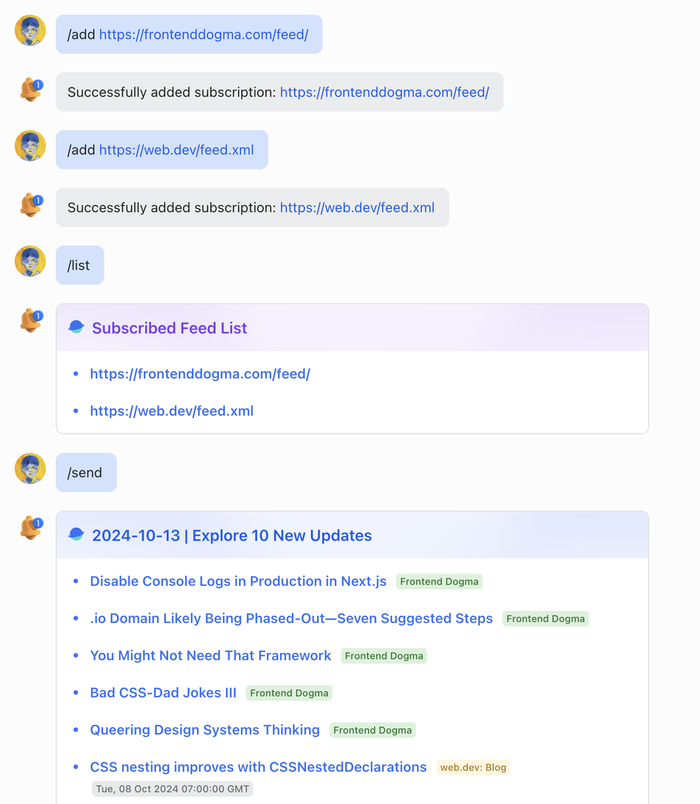

# RSS Feishu Bot

## Screenshot

Here's a glimpse of the bot in action:

## Deployment

To get started with the RSS Feishu Bot, follow these simple steps:

1. **Deploy the Bot:**
   - Deploy the bot to an online service such as [Render](https://render.com) or use `ngrok` for a reverse proxy setup.
   - Ensure your deployment is accessible via a domain or subdomain.

2. **Create Your Feishu Bot:**
   - Within your Feishu developer console, add a `Bot` feature to your app.
   - Grant the bot the necessary permissions:
     - `im:message`
     - `im:chat`
     - `bitable:app`
   - Configure the request URLs for both `Event Configuration` and `Callback Configuration`:
     - Event URL: `https://<your_domain>/feishu/event`
     - Callback URL: `https://<your_domain>/feishu/callback`

3. **Set Up the Database:**
   - Create a copy of the provided [Bitable](https://bqc4atlhac.feishu.cn/base/Vh7HbLOePaU1JIsCo57c4TNxnZd?table=tblUxRpo0003GgId&view=vewfeMW8O8) to use as your bot's database.
   - Send the link of your bitable to the bot and grant access.

4. **Create a Card Template:**
   - Utilize Feishu's [CardKit](https://open.feishu.cn/cardkit) to create a card template by importing the `asset/card_template.card`.

5. **Configure Environment Variables:**
   - In `config/app.go`, set the environment variables to match your service configuration.

## Usage

Interact with the RSS Feishu Bot using the following commands within Feishu:

- `/list [-g | --group]`: List all subscribed feeds.
- `/add [-g | --group] <url>`: Add a new subscription.
- `/remove [-g | --group] <url>`: Remove a subscription.
- `/send [-g | --group]`: Send the latest RSS updates.
- `/help`: Display this help message.

## Auto Push Setup

To automatically push updates, set up a cron job to periodically request `https://<your_domain>/rss/send`. You can use Feishu's official [BotBuilder](https://botbuilder.feishu.cn/home) to create and manage your cron jobs.
